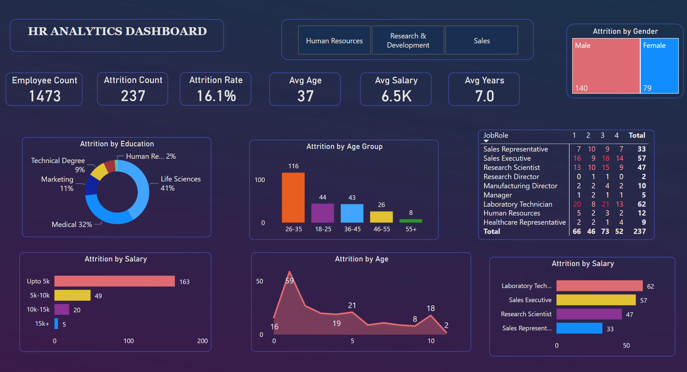

# HR ANALYTICS DASHBOARD

## Objective:
Help an organization to improve emloyee performance and imporove retention (reduce attrition) by creating an HR Analytics dashboard.

 Here are the steps involved in creating HR analytics dashboard:

### 1. Slicer Filter for Department:
   - Implement a slicer filter on the dashboard that allows users to select specific departments for analysis and exploration.

### 2. Key Performance Indicators (KPIs):
   - Include six KPIs that provide essential insights into the workforce:
     - Employee Count: Display the total number of employees in each department.
     - Attrition Count: Show the count of employees who have left the company in each department.
     - Attrition Rate: Calculate and visualize the percentage of employees who have left in each department.
     - Average Age of Employees: Present the average age of employees in each department.
     - Average Salary: Display the average salary of employees in each department.
     - Average Years of Service: Show the average number of years employees have served in each department.

### 3. Donut Chart for Attrition by Education Background:
   - Create a donut chart that represents the proportion of employees who have left the company based on their education background.

### 4. Column Chart for Attrition by Age Group:
   - Develop a column chart to illustrate the attrition of employees categorized into different age groups.

### 5. Matrix with Job Role, Job Satisfaction Score, and Attrition:
   - Build a matrix that displays job roles along with corresponding job satisfaction scores and attrition status.

### 6. Bar Chart for Attrition by Salary:
   - Construct a bar chart to showcase the number of employees who have left the company at different salary levels.

### 7. Line Chart for Attrition by Age:
   - Utilize a line chart to visualize the trend of attrition based on employees' age.

### 8. Bar Chart for Attrition by Job Role:
   - Create a bar chart to represent the attrition rate for each job role within the organization.

### 9. Tree Chart for Attrition by Gender:
   - Use a tree chart to demonstrate the attrition numbers for male and female employees who have left the company.

# Insights from the HR Analytics Dashboard:

### 1. Department Analysis: 
By using the slicer filter for departments, you can analyze and compare various HR metrics across different departments. This helps identify departments with higher attrition rates, lower job satisfaction scores, or specific trends that require attention.

### 2. Attrition Patterns by Education Background: 
The donut chart showcasing attrition by education background can reveal if certain education qualifications have a higher attrition rate. This insight can be used to identify potential issues related to specific education backgrounds and take appropriate actions.

### 3. Understanding Attrition by Age: 
The column chart displaying attrition by age group enables you to identify any age-related trends in employee attrition. It helps to pinpoint age groups that may require special attention, such as identifying potential issues related to career progression or work-life balance.

### 4. Job Role Analysis: 
The matrix presenting job roles, job satisfaction scores, and attrition status helps identify any specific job roles that experience higher attrition rates. This information can be used to assess factors such as workload, growth opportunities, or workplace culture that may impact employee retention.

### 5. Salary-Related Attrition: 
The bar chart illustrating attrition by salary levels provides insights into whether there is a correlation between salary and attrition. It helps identify salary ranges where attrition is particularly high, which can inform compensation and benefits strategies to improve employee retention.

### 6. Attrition by Gender: 
The tree chart depicting attrition by gender can highlight any gender-based attrition patterns within the organization. This insight can prompt a closer examination of potential issues related to diversity and inclusion, career development, or work environment that may affect employee retention.

## Ways to Retain Employees:

### 1. Competitive Compensation and Benefits: 
Regularly assess and benchmark your organization's salary and benefits packages to ensure they remain competitive in the market. Consider offering incentives such as performance bonuses, health and wellness programs, or flexible work arrangements.

### 2. Professional Development and Growth Opportunities: 
Provide employees with opportunities for continuous learning, skill development, and career advancement. Establish mentorship programs, encourage participation in training workshops, and offer clear pathways for promotion and development within the organization.

## 3. Employee Engagement and Recognition: 
Foster a positive work environment by promoting employee engagement initiatives. Encourage open communication, recognize and appreciate employees' contributions, and implement employee recognition programs to boost morale and job satisfaction.

### 4. Work-Life Balance: 
Promote work-life balance by offering flexible work arrangements, encouraging employees to take time off, and ensuring manageable workloads. Support employee well-being through initiatives like mental health programs, wellness activities, and employee assistance programs.

### 5. Performance Feedback and Goal Alignment: 
Establish regular performance feedback processes to provide employees with constructive feedback and help them align their goals with organizational objectives. Encourage open dialogue, set clear expectations, and provide opportunities for professional growth based on individual aspirations.

